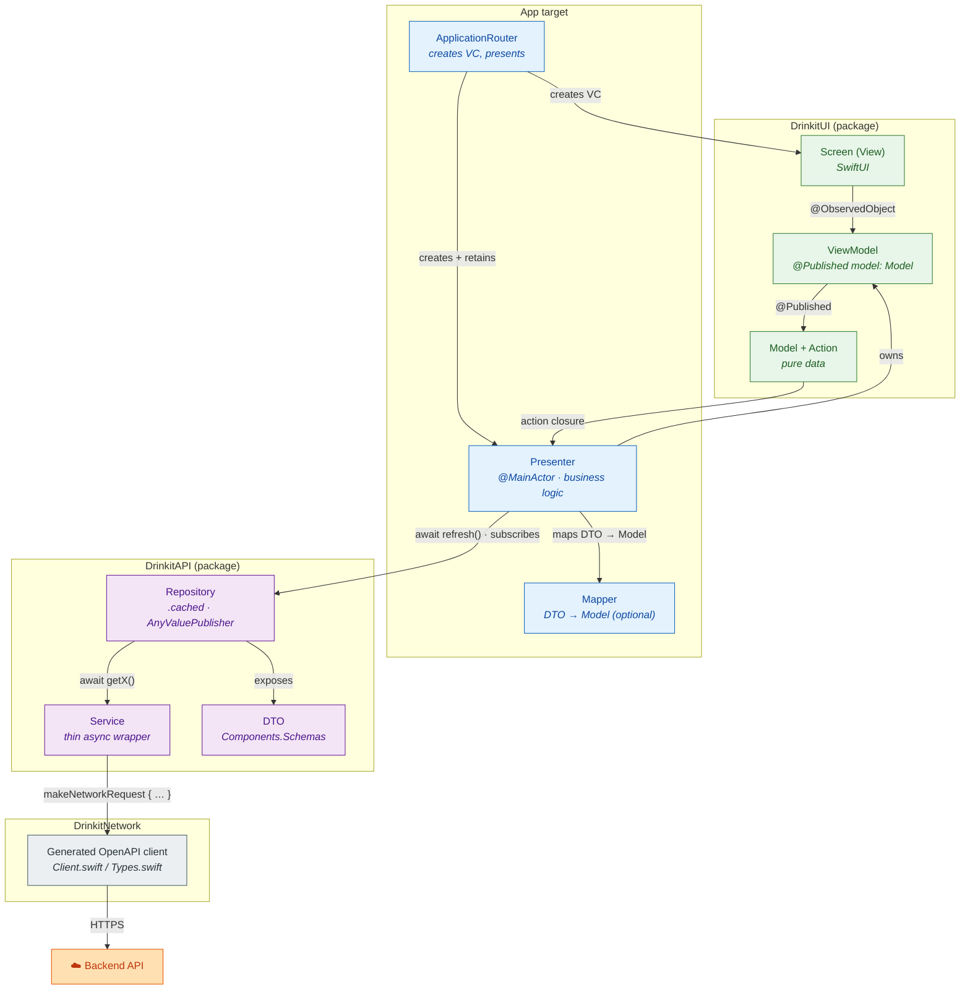
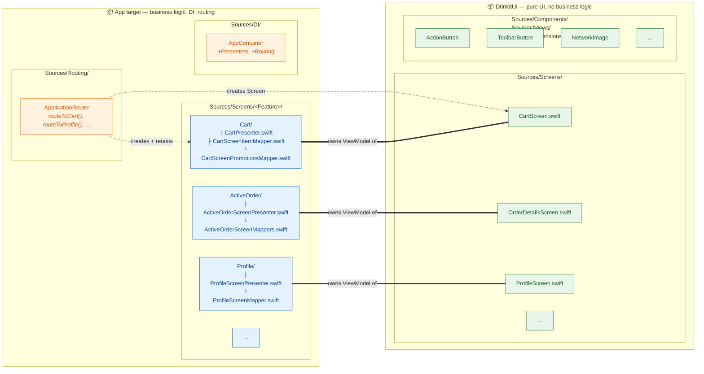

# Drinkit iOS — Architecture

> Companion doc for the "KMP without rewriting the app" talk. The deck's
> iOS-architecture slides (currently ~14, ~42, ~44, ~45) show a higher-level
> view of the same structure — they don't contradict; the slide is
> "30,000 ft" and this doc is "ground level". Keep them in sync when the
> iOS module story changes. See `CLAUDE.md` §"The one rule you must not
> break" for the synced-files rule.

High-level map of the iOS app: targets, SPM packages, layers, and dependency directions.
All arrows point from a dependent module **to** its dependency (`A → B` reads "A depends on B").

## Module / package graph

```mermaid
%%{init: {'flowchart': {'curve': 'basis'}, 'theme': 'default'}}%%
flowchart TB

    %% ==================== TARGETS ====================
    subgraph TARGETS["📱 App Targets"]
        direction LR
        App["Drinkit (App)"]
        LiveActivity["LiveActivity"]
        NotifExt["NotificationServiceExtension"]
        Playground["Playground"]
        UITests["UITests"]
        UnitTests["UnitTests"]
    end

    %% ==================== INTEGRATIONS ====================
    subgraph INTEGRATIONS["🔌 Integrations / Tooling"]
        direction LR
        DrinkitAnalyticsTrackers["DrinkitAnalyticsTrackers<br/><i>Amplitude · Firebase · AppsFlyer · Kusto</i>"]
        DrinkitDebug["DrinkitDebug<br/><i>DebugSwift · Pulse · BlackBox</i>"]
    end

    %% ==================== DOMAIN / DATA ====================
    subgraph DOMAIN["🧠 Domain & Data"]
        direction LR
        DrinkitAPI["DrinkitAPI<br/><i>Services · Repositories · DTOs</i>"]
        DrinkitFeatureToggles["DrinkitFeatureToggles"]
        DrinkitCaptcha["DrinkitCaptcha<br/><i>hCaptcha · Yandex</i>"]
    end

    %% ==================== UI ====================
    subgraph UI_LAYER["🎨 UI Components"]
        direction LR
        DrinkitUI["DrinkitUI<br/><i>SwiftUI · Nuke · Lottie</i>"]
        DrinkitUIKit["DrinkitUIKit<br/><i>UIKit components</i>"]
    end

    %% ==================== INFRA ====================
    subgraph INFRA["⚙️ Infrastructure"]
        direction LR
        DrinkitAnalytics["DrinkitAnalytics<br/><i>Events core</i>"]
        DrinkitPersistence["DrinkitPersistence<br/><i>Keychain · Storage</i>"]
        DrinkitLog["DrinkitLog<br/><i>BlackBox</i>"]
    end

    %% ==================== FOUNDATION ====================
    subgraph FOUNDATION["🧱 Foundation"]
        direction LR
        DrinkitFoundation["DrinkitFoundation<br/><i>Utilities · Extensions</i>"]
        DrinkitResources["DrinkitResources<br/><i>Strings · Fonts · Images</i>"]
        DrinkitNetwork["DrinkitNetwork<br/><i>OpenAPI client</i>"]
        DrinkitPlaygroundMacro["DrinkitPlaygroundMacro<br/><i>Swift macros</i>"]
    end

    %% ==================== APP TARGET DEPENDENCIES ====================
    App --> DrinkitAPI
    App --> DrinkitFeatureToggles
    App --> DrinkitAnalytics
    App --> DrinkitAnalyticsTrackers
    App --> DrinkitDebug
    App --> DrinkitUI
    App --> DrinkitUIKit
    App --> DrinkitResources
    App --> DrinkitFoundation
    App --> DrinkitLog
    App --> DrinkitPersistence

    Playground --> DrinkitUI
    Playground --> DrinkitUIKit
    Playground --> DrinkitPlaygroundMacro

    LiveActivity --> DrinkitUI
    LiveActivity --> DrinkitResources
    NotifExt --> DrinkitFoundation

    UnitTests --> App
    UITests --> App

    %% ==================== INTEGRATIONS DEPENDENCIES ====================
    DrinkitAnalyticsTrackers --> DrinkitAnalytics
    DrinkitDebug --> DrinkitAnalytics

    %% ==================== DOMAIN DEPENDENCIES ====================
    DrinkitAPI --> DrinkitNetwork
    DrinkitAPI --> DrinkitCaptcha
    DrinkitAPI --> DrinkitFeatureToggles
    DrinkitAPI --> DrinkitAnalytics
    DrinkitAPI --> DrinkitPersistence
    DrinkitAPI --> DrinkitLog
    DrinkitAPI --> DrinkitFoundation

    DrinkitFeatureToggles --> DrinkitUI
    DrinkitFeatureToggles --> DrinkitPersistence
    DrinkitFeatureToggles --> DrinkitLog
    DrinkitFeatureToggles --> DrinkitFoundation

    DrinkitCaptcha --> DrinkitResources
    DrinkitCaptcha --> DrinkitAnalytics
    DrinkitCaptcha --> DrinkitLog

    %% ==================== UI DEPENDENCIES ====================
    DrinkitUI --> DrinkitResources
    DrinkitUI --> DrinkitFoundation
    DrinkitUIKit --> DrinkitResources
    DrinkitUIKit --> DrinkitFoundation
    DrinkitUIKit --> DrinkitLog

    %% ==================== INFRA DEPENDENCIES ====================
    DrinkitAnalytics --> DrinkitFoundation
    DrinkitPersistence --> DrinkitLog
    DrinkitPersistence --> DrinkitFoundation
    DrinkitLog --> DrinkitFoundation

    %% ==================== STYLING ====================
    classDef target fill:#e3f2fd,stroke:#1565c0,stroke-width:2px,color:#0d47a1
    classDef integration fill:#fff3e0,stroke:#ef6c00,stroke-width:1.5px,color:#e65100
    classDef domain fill:#f3e5f5,stroke:#6a1b9a,stroke-width:1.5px,color:#4a148c
    classDef ui fill:#e8f5e9,stroke:#2e7d32,stroke-width:1.5px,color:#1b5e20
    classDef infra fill:#fce4ec,stroke:#ad1457,stroke-width:1.5px,color:#880e4f
    classDef foundation fill:#eceff1,stroke:#455a64,stroke-width:1.5px,color:#263238

    class App,LiveActivity,NotifExt,Playground,UITests,UnitTests target
    class DrinkitAnalyticsTrackers,DrinkitDebug integration
    class DrinkitAPI,DrinkitFeatureToggles,DrinkitCaptcha domain
    class DrinkitUI,DrinkitUIKit ui
    class DrinkitAnalytics,DrinkitPersistence,DrinkitLog infra
    class DrinkitFoundation,DrinkitResources,DrinkitNetwork,DrinkitPlaygroundMacro foundation
```

## Runtime layering inside the App target

How a SwiftUI screen, its presenter, the domain layer, and the backend collaborate at runtime.

## Where a feature lives

A single feature (e.g. **Cart**, **OrderDetails**, **Profile**) is **split across two packages** — the pure-UI half lives in `DrinkitUI`, the business-logic half lives in the App target. There is no single "Cart module" folder; the feature is the sum of both halves, glued together by the router.

**Rules of thumb for where a file goes:**

| File | Lives in | Why |
|---|---|---|
| `XxxScreen.swift` (View + ViewModel + Model) | `DrinkitUI/Sources/Screens/` | Pure SwiftUI, no DTO / service / repo imports. |
| Reusable component (`ActionButton`, etc.) | `DrinkitUI/Sources/Components/` or `Views/` | UI only, no feature-specific knowledge. |
| `XxxScreenPresenter.swift` | `App/Sources/Screens/<Feature>/` | `@MainActor`, owns ViewModel, depends on `DrinkitAPI` repositories. |
| `XxxScreenMapper.swift` | `App/Sources/Screens/<Feature>/` | DTO → `Model` conversion, separated from presenter when non-trivial. |
| `routeToXxx(...)` | `App/Sources/Routing/ApplicationRouter` | Creates presenter, creates Screen with `presenter.viewModel`, presents VC. |
| Storyboard ViewController (legacy) | `App/Sources/Screens/<Feature>/` | Pre-SwiftUI feature still using UIKit. |

## Layer responsibilities

| Layer | Modules | Role |
|---|---|---|
| **App Targets** | `Drinkit`, `LiveActivity`, `NotificationServiceExtension`, `Playground` | Composition root, routing, presenters, DI wiring (`AppContainer`). |
| **Integrations** | `DrinkitAnalyticsTrackers`, `DrinkitDebug` | Concrete third-party SDK adapters (Amplitude, Firebase, AppsFlyer, Pulse, DebugSwift). |
| **Domain & Data** | `DrinkitAPI`, `DrinkitFeatureToggles`, `DrinkitCaptcha` | Repositories, services, DTOs, feature flag runtime, captcha flow (`APIContainer`). |
| **UI Components** | `DrinkitUI`, `DrinkitUIKit` | Reusable Screens, Views, design tokens, components — no business logic. |
| **Infrastructure** | `DrinkitAnalytics`, `DrinkitPersistence`, `DrinkitLog` | Cross-cutting primitives: event bus, storages, logging. |
| **Foundation** | `DrinkitFoundation`, `DrinkitResources`, `DrinkitNetwork`, `DrinkitPlaygroundMacro` | Zero-dependency base: utilities, assets, generated OpenAPI client, macros. |

## Dependency rules

- Arrows only flow **downward** between layers — UI/Domain depend on Infrastructure and Foundation, never the other way around.
- `DrinkitUI` is intentionally **decoupled from `DrinkitAPI`** — UI components own only `Model` / `ViewModel`; mapping from DTOs lives in the App target.
- Cross-boundary deps from `APIContainer` into the App target use the "deferred registration" pattern (see `llm/docs/dependency-injection.md`).
- `DrinkitFoundation` is the only module every other package can safely depend on.
