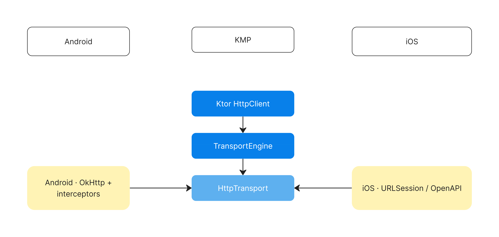

# Authoring guide

How this deck is built and how to change it in future sessions.
Aimed at the **next person editing the talk** (which may be a fresh
Claude session — write changes accordingly).

> See [`README.md`](README.md) for how to *run* the deck. This file
> is about how to *edit* it.

---

## 0. The golden rule: plan ↔ deck stay in sync

The repo has two artifacts that describe the same talk:

| File | Role | Authority |
|---|---|---|
| `../PRESENTATION_PLAN.md` | The talk script — slide intent, speaker notes, code-snippet sources, image needs. | **Source of truth for what the talk *says*.** |
| `presentation/index.html` | The actual deck rendered to the audience. | **Source of truth for what the audience *sees*.** |

The plan and deck **must agree on slide count and slide order**. The
`PRESENTATION_PLAN.md` slide-naming convention
(`### Slide N | TYPE | short title`) is mirrored verbatim in HTML
comments above each `<section>`:

```html
<!-- 77 · CODE · CreatedDrinkResult sealed type -->
<section class="slide slide--content"> … </section>
```

This is the *only* way to identify a slide in `index.html` — there are
no numeric IDs on the `<section>` elements themselves, because page
numbers are computed at runtime by `js/nav.js`. So the **comment
marker is the join key** between the plan and the deck.

### Any change to slides must touch both files

| Change | Plan | Deck |
|---|---|---|
| Edit slide content / on-screen text | ✅ update slide entry | ✅ edit the `<section>` |
| Edit speaker notes only | ✅ update `Speaker:` line | (no change) |
| Add a slide | ✅ insert new `### Slide N` entry, **renumber everything after** | ✅ insert new `<section>` with matching comment, **renumber the comment markers after** |
| Remove a slide | ✅ delete entry, renumber after | ✅ delete `<section>` + comment, renumber comments after |
| Reorder slides | ✅ renumber affected entries | ✅ move `<section>` blocks + renumber affected comments |
| Change slide layout type | ✅ change `TYPE` in the heading | ✅ change `slide--TYPE` class |
| Change code snippet | ✅ update the cited file path / lines table | ✅ replace `<pre class="code-block">` contents |
| Change image / diagram | ✅ update `Visual:` / `Image:` line | ✅ replace the placeholder / SVG |

If only one side is updated, the next editor (human or AI) will lose
the context that makes the diff defensible. **Always update both.**

### Renumbering is the only painful part

Adding or removing a slide cascades: every later slide's comment
marker and plan heading shift by one. Two safe ways to do this:

1. **Just edit-the-numbers manually** if the change is at the end of
   a section (≤10 slides shift). Easy and low-risk.
2. **Append at end** if it's a brand-new slide for a brand-new idea
   — no renumbering at all.
3. **Use a real find-and-replace pass** if you're shifting a big chunk
   — e.g. `Slide 9[0-9] ` → `Slide …`. Verify the count at the bottom
   of the plan's `Slide-count summary` table afterwards.

Page numbers in the rendered deck are generated by `nav.js` from
DOM order, so renumbering comment markers and `<section>` order is
all that's needed; nothing else updates manually.

### Quick sanity checks before committing

```bash
# All ~125 (or however many) slides accounted for in the deck:
grep -c '<section class="slide' presentation/index.html

# Comment markers go 1..N with no gaps:
grep -oE '<!-- ([0-9]+) ' presentation/index.html \
  | awk '{print $2+0}' | sort -n | uniq -c | awk '$1!=1'   # prints nothing if ok

# Plan and deck agree on slide count:
grep -cE '^### Slide [0-9]+ ' PRESENTATION_PLAN.md
```

---

## 1. Project structure

```
presentation/
├── README.md          ← how to run
├── AUTHORING.md       ← this file
├── index.html         ← all slides, in plan order, one <section> each
├── css/
│   ├── theme.css      ← COPY of ../dodo-theme/css/theme.css   (don't edit here)
│   ├── slide.css      ← COPY of ../dodo-theme/css/slide.css   (don't edit here)
│   └── deck.css       ← presentation-specific styles + animations
└── js/
    └── nav.js         ← runtime: nav, scaling, hash, overview, fullscreen
```

### What lives where

| Concern | File |
|---|---|
| Brand palette, fonts, spacing scale, slide canvas size | `css/theme.css` (token mirror — see below) |
| Slide layout primitives (`.slide--cover`, `.slide__title`, `.list`, `.tag`, etc.) | `css/slide.css` (theme mirror — see below) |
| BIG-WORD slide style, phone mocks, code tints, animations, nav chrome, fullscreen, overview | `css/deck.css` |
| Each individual slide | `index.html` |
| Keyboard, touch, page-number stamping, hash deep-links, fullscreen API, overview mode | `js/nav.js` |

### theme.css / slide.css are mirrors of `../dodo-theme/`

They were copied verbatim so the deck is self-contained. **Do not
edit them in `presentation/css/`.** If you need to tweak the theme
itself (e.g. add a new pastel color, change a font fallback), edit
`../dodo-theme/css/theme.css` and then re-copy:

```bash
cp ../dodo-theme/css/theme.css presentation/css/theme.css
cp ../dodo-theme/css/slide.css presentation/css/slide.css
```

All deck-specific styling (anything not in the original PowerPoint
theme) belongs in **`presentation/css/deck.css`** — that's where you
add custom classes, animations, page-specific tweaks.

---

## 2. The slide grammar

Every slide is one `<section>` like this:

```html
<!-- 42 · TYPE · short title -->
<section class="slide slide--LAYOUT">
   … content …
</section>
```

The comment is **required**: it pairs with the plan entry. The
`slide--LAYOUT` class picks the visual shape.

### Layout types

| Class | What it's for | Plan TYPEs that use it |
|---|---|---|
| `slide--cover`      | Title card (slide 1). Big gradient bg, brand line, big title with `<em>` highlight. | `TITLE` |
| `slide--section`    | Chapter break. Eyebrow + big title + orange rule animates in. | `BIG-WORD` when used as section heading |
| `slide--content`    | The workhorse — title at top, body below. | `BULLETS`, `IMAGE`, `CODE`, `DIAGRAM` |
| `slide--two-col`    | Two-column compare. Use orange eyebrow on the left, purple on the right. | `COMPARE` |
| `slide--bigword`    | Centered single phrase, large bold text. Use `<span class="bw--accent">` (purple) or `<span class="bw--orange">` for emphasis. `bw--md` and `bw--sm` are smaller variants. | `BIG-WORD` |
| `slide--bigword slide--transition` | Soft transition word — lighter weight, secondary color. | `TRANSITION` |

### Picking a layout from a plan entry

The plan entry's `TYPE` maps to a layout 1:1 except for compares and
section headers. Quick reference:

- `BIG-WORD` (any chapter break) → `slide--section`
- `BIG-WORD` (any other) → `slide--bigword`
- `BULLETS`, `IMAGE`, `CODE`, `DIAGRAM` → `slide--content`
- `COMPARE` → `slide--two-col`
- `TRANSITION` → `slide--bigword slide--transition`
- `OUTRO` → `slide--bigword` (`Q&A`, `Thank you`)
- `TITLE` → `slide--cover`

### Required parts of a content slide

```html
<section class="slide slide--content">
  <h3 class="slide__title">Slide title — 14pt bold, top-left</h3>
  <div class="slide__body">
    … body content …
  </div>
  <!-- no page number tag needed — nav.js stamps it -->
</section>
```

---

## 3. Common editing recipes

### 3.1 Change the text on a slide

1. Find by comment marker: `grep -n '<!-- 77 ·' presentation/index.html`
2. Edit the text inside the `<section>`.
3. Update the `On-screen text:` line in the matching plan entry.
4. Speaker-only changes still update **only the plan** (the deck has
   no speaker notes embedded — those are presenter-side).

### 3.2 Change a slide's layout type

Don't just swap the class — the content shape is different. Easiest
path:

1. Pick the new type from §2.
2. Re-author the body using the [reference slides in
   `../dodo-theme/slides/`](../dodo-theme/slides/) as templates.
3. Update both the comment marker (`<!-- N · NEW-TYPE · ... -->`) and
   the plan heading (`### Slide N | NEW-TYPE | ...`).

### 3.3 Add a slide

```html
<!-- INSERT into index.html at the right spot, e.g. after slide 88 -->
<!-- 89 · BULLETS · New thing -->
<section class="slide slide--content">
  <h3 class="slide__title">New thing</h3>
  <div class="slide__body">
    <ul class="list list--lg stagger">
      <li>One.</li>
      <li>Two.</li>
    </ul>
  </div>
</section>
```

Then:
- Renumber every later comment marker (`90 →`, `91 →`, …).
- Insert a matching `### Slide 89 | BULLETS | New thing` in
  `PRESENTATION_PLAN.md` and renumber later headings.
- Bump the per-part count in the plan's `Slide-count summary` table
  (and the total).
- Run the sanity checks from §0.

The deck counter (`134` at the bottom of `index.html`) is informational
only — `nav.js` reads the actual DOM length, so you don't strictly
need to bump it. But keep it accurate for readers of the source.

### 3.4 Remove a slide

Inverse of §3.3. Delete the `<section>` + its comment, renumber later
markers and the matching plan headings, update the per-part count and
total in the plan.

### 3.5 Reorder slides inside a section

1. Move whole `<section>` blocks (with their comment markers) in
   `index.html`.
2. Renumber the comments.
3. Mirror the move in `PRESENTATION_PLAN.md` and renumber there.

---

## 4. Visual elements

### 4.1 Code blocks

```html
<pre class="code-block"><span class="tok-k">interface</span> <span class="tok-t">AiService</span> {
    <span class="tok-k">suspend fun</span> <span class="tok-n">createDrink</span>(prompt: <span class="tok-t">String</span>): <span class="tok-t">CreatedDrinkResult</span>
}</pre>
```

Token classes (hand-rolled — no syntax-highlighter library):

| Class | Purpose | Color |
|---|---|---|
| `tok-k` | Keyword (`fun`, `class`, `val`, `if`, `try await`) | accent purple, semibold |
| `tok-t` | Type name (`String`, `Boolean`, `MyClass`) | teal |
| `tok-n` | Name / identifier (function name, parameter, literal number) | accent blue |
| `tok-s` | String literal | accent orange |
| `tok-c` | Comment / annotation (`// ...`, `@GET("...")`) | muted, italic |
| `tok-a` | Attribute / property | secondary text |

Indentation in `<pre>` is significant — keep it as spaces. The
deck.css sets `font-size: 13pt` for code blocks; if a snippet
overflows, trim it (the plan's "trimmed real snippet" rule applies
— drop imports, drop docstrings unless quoted) rather than shrink the
font.

Optional caption above the block:

```html
<p class="code-caption">ai/src/commonMain/.../api/AiService.kt</p>
<pre class="code-block">…</pre>
```

### 4.2 Images and photos

Real assets land in `presentation/assets/` with these subfolders:

```
presentation/assets/
├── portrait.jpg            ← slide 2 (about me)
├── qr.png                  ← slide 124 (contacts/QR)
├── screens/                ← app screenshots (PNG, native phone res)
├── diagrams/               ← hand-drawn architecture diagrams (PNG)
├── media/                  ← short videos (WEBM/VP9, ~10 MB target)
└── mocks/                  ← designed mockups (bug ticket, etc.) — v3
```

**Filename convention: content-based** (not slide-numbered). Slide numbers
shift between iterations; content names don't. Examples:
- `screens/menu-ios.png`, `screens/menu-android.png`
- `diagrams/transport-flow.png`
- `media/combo-transition.webm`

**Replace a CSS phone mockup with a real screenshot:**

```html
<!-- before -->
<div class="phone">
  <div class="phone__screen">
    <div class="phone__hero"></div>
    …
  </div>
</div>

<!-- after -->
<div class="phone phone--real">
  <div class="phone__screen">
    
  </div>
</div>
```

The `.phone--real` modifier hides the CSS notch and dark frame;
`.phone__shot` fills the screen with `object-fit: cover` and a 22px
corner radius. Both are defined in `css/deck.css`.

**Replace with a video** (e.g., slides 18, 25): same pattern but swap
`` for `<video src="…" autoplay loop muted playsinline class="phone__shot">`.
The deck encodes videos as WEBM (VP9) at ~1.5 Mbit/s — that's small
enough to load fast but high-quality at slide-render size.

**Replace the "About me" portrait** (slide 2): swap the gradient `<div>`
for `` with `aspect-ratio: 1/1;
border-radius: 24px; object-fit: cover`.

### 4.3 Diagrams (inline SVG)

Some architecture diagrams are still inline SVG with `viewBox` so they
scale to fit. Currently inline: slides 14 (silhouette teaser), 49
(greenfield tree), 75 (shape of stateful feature), 80 (three sockets).

Conventions:
- Use **theme pastels** for fills (`#B8B8FF`, `#FFC2A5`, `#D2FCEE`,
  `#FFF3B5`, `#FFCCF9`) — they read well at slide size.
- Use **bright accents** for emphasis: `#694BFB` (purple) for the
  shared/KMP module, `#FF5401` (orange) for caption text.
- Stroke color for lines: `#161616` (primary text).
- Use the `<defs><marker id="arr">…</marker></defs>` pattern for
  arrowheads; existing diagrams have working examples.
- Keep `viewBox` aspect at roughly 2:1 — leaves room for a caption
  underneath.

### 4.3a External diagrams (PNG)

The load-bearing architecture diagrams live as PNG files in
`assets/diagrams/`. These are hand-drawn (Figma / Excalidraw / etc.)
because the SVG versions read as colored rectangles and the talk's
"money shot" needs more polish. Convention:

| When to inline SVG | When to use external PNG |
|---|---|
| Schematic / minimal diagrams where shape carries the meaning (slides 14, 49, 75, 80) | Hand-drawn or load-bearing architecture diagrams (slides 56, 57, 58, 60–61, 82, 91) |
| Need to inherit theme CSS colors via `fill`/`stroke` | Diagram has too much detail for hand-coded SVG to maintain |
| Stays sync'd with deck markup edits | Edits happen in a drawing tool |

Wire an external diagram with:

```html
<div class="slide__body diagram-wrap">
  
</div>
```

`.diagram-img` sizes the image with `object-fit: contain` so it scales
like the inline SVGs do.

### 4.4 Phone mockups (placeholder screenshots)

```html
<div class="phone">
  <div class="phone__label">iOS</div>       <!-- optional, above phone -->
  <div class="phone__screen">
    <div class="phone__hero"></div>          <!-- the brown coffee gradient -->
    <div class="phone__row"></div>           <!-- thin gray bar -->
    <div class="phone__card"></div>          <!-- pastel-peach card -->
    <div class="phone__card phone__card--mint"></div>
    <div class="phone__card phone__card--purple"></div>
    <div class="phone__card phone__card--yellow"></div>
  </div>
</div>
```

For the side-by-side comparison rows (slides 8–11), wrap two `.phone`
elements in `<div class="phones">` (provides the horizontal layout +
gap). Adding `class="phone anim-from-left"` / `anim-from-right` makes
them slide in.

When a real screenshot exists for a slide, use the `.phone--real`
pattern described in §4.2 instead of stacking CSS placeholders. The
two patterns can coexist in the same deck — slides without a screenshot
keep the CSS phones while wired slides use real images.

### 4.5 BIG-WORD slides

```html
<section class="slide slide--bigword">
  <div class="bw">Same outside.</div>
</section>
```

Variants:

```html
<div class="bw bw--md">slightly smaller text</div>
<div class="bw bw--sm">even smaller, fits two lines comfortably</div>
<div class="bw">Plain. <span class="bw--accent">Highlighted purple.</span></div>
<div class="bw">Plain. <span class="bw--orange">Highlighted orange.</span></div>
<div class="bw"><span class="strike">"wrong frame"</span><span class="bw__sub">// commentary</span></div>
```

Use highlight spans **sparingly** — one per slide is the rule.

### 4.6 Two-column compare

```html
<section class="slide slide--two-col">
  <h3 class="slide__title">Side-by-side title</h3>
  <div class="slide__columns">
    <div class="slide__col anim-from-left">
      <p class="t-mono-bold" style="color: var(--color-accent-orange);">// before</p>
      <h4>Heading</h4>
      <ul class="list"><li>…</li></ul>
    </div>
    <div class="slide__col anim-from-right">
      <p class="t-mono-bold" style="color: var(--color-accent-purple);">// after</p>
      <h4>Heading</h4>
      <ul class="list"><li>…</li></ul>
    </div>
  </div>
</section>
```

Convention from the source theme: **left column eyebrow = orange,
right column eyebrow = purple.** Stick to it for visual consistency.

---

## 5. Animations

Defined in `css/deck.css` under "Animations".

| Class | Effect | When to use |
|---|---|---|
| `anim-fade` | 0.6s opacity 0→1 | Subtle reveal of single elements |
| `anim-rise`, `anim-rise-2`, `anim-rise-3`, `anim-rise-4` | translateY(24px) + fade, with cumulative delays | A few elements that should appear in sequence |
| `anim-from-left` / `anim-from-right` | Slide in horizontally | Compare-slide columns, side-by-side phones |
| `stagger` (parent class) | Child `>` elements each `rise-in` with 0.1s incremental delay (1–6 children) | Bullet lists, address blocks |
| `pop-in` | scale + fade — **applied automatically to `.slide--bigword .bw`** | Don't add manually |
| `draw-rule` | Width 0 → 96px — **applied automatically to section headers** | Don't add manually |

Animation rule of thumb: **a slide should feel like one event, not a
parade.** If you find yourself adding 5+ animations to one slide,
delete most of them.

All animations are gated by `@media (prefers-reduced-motion: reduce)`
in `deck.css` — they degrade to instant rendering automatically.

---

## 6. Spacing, sizing, padding

### Don't hardcode hex codes or font names

The theme exposes CSS variables for everything. From the dodo-theme
README's rules:

> Use the CSS variables (or the typography utility classes), never
> hardcoded hex codes or font names.

| You want | Use |
|---|---|
| Body text | `class="t-body"` or default — already correct |
| Slide title (top of content slides) | `class="slide__title"` (14pt bold) |
| H2-H5 headings | `class="t-h2"` … `class="t-h5"` |
| Big cover text | `class="t-cover-xl"` / `t-cover-l` / `t-cover` |
| Code in prose | `<code>…</code>` (inline) or `<pre class="code-block">` |
| Pastel pill tag | `<span class="tag tag--mint">label</span>` (also `--purple`, `--peach`, `--yellow`, `--pink`) |
| Purple accent | `color: var(--color-accent-purple)` |
| Orange accent | `color: var(--color-accent-orange)` |

### Padding / offsets

Slide-edge padding is set by theme variables in `theme.css`:

```css
--slide-pad-top:    5.3%;
--slide-pad-right:  3%;
--slide-pad-bottom: 5.3%;
--slide-pad-left:   3%;
```

These are **percentages of the 1280×720 canvas** — don't change them
casually; they're the source PowerPoint's exact safe-area. If you
need a slide that bleeds full-width (an image, a hero), use a child
container with `margin: 0 calc(var(--slide-pad-left) * -1)` inside the
slide.

The 4px-base spacing scale (`--space-1` = 4px, `--space-2` = 8px, …
`--space-20` = 80px) is in `theme.css`. Use those everywhere instead
of magic numbers. Inline-style `gap: 24px` is bad; `gap:
var(--space-6)` is good.

### Slide canvas size — don't change it

```css
--slide-width:  1280px;
--slide-height: 720px;
```

These are the **source PowerPoint's** logical pixel size and the
basis for everything else. `js/nav.js` computes a uniform scale to
fit the viewport. **Don't change the canvas size** — layouts will
reflow and the pixel-true 16:9 will break.

---

## 7. The runtime — `js/nav.js`

| Responsibility | Detail |
|---|---|
| Stamp page numbers | Adds a `.slide__page-num` to every slide on load, numbered from DOM order (`01` … `NN`). |
| Update total counter | Writes `slides.length` into the `#tot` span. |
| Navigate | `next()` / `prev()` / `go(n)` switch `.is-active`. Single slide visible at a time. |
| Keyboard | `→`, `space`, `PageDown`, `l`, `j` = next; `←`, `PageUp`, `h`, `k` = prev; `Home`/`End`; `o`/`Esc` = overview; `f` = fullscreen; `g` = prompt for slide #. |
| Touch | Horizontal swipe > 40px navigates. |
| Hash sync | Current slide is reflected as `#42` in the URL; `history.replaceState` so back-button doesn't pollute history. |
| Fullscreen | Cross-browser (`document.fullscreenElement` + WebKit prefix). Adds `is-fullscreen` class to `<body>` for CSS styling. |
| Overview mode | Scales all slides to 0.25× in a grid; click a slide to jump and exit. |
| Idle cursor | In fullscreen, after 1.8s with no mouse movement, cursor hides and nav chrome disappears. |
| Scaling | On resize, computes `transform: scale(min(vw/1280, vh/720) * 0.96)` on `#deck`. |

### Adding a new keyboard shortcut

In `js/nav.js`, find the `keydown` switch statement and add a case:

```js
case 'p':
  e.preventDefault();
  window.print();  // e.g. PDF export
  break;
```

Then mention it in `README.md` and the `.hint` line at the bottom of
`index.html`.

### Adding a new nav button

1. Add a `<button id="myAction" …>` inside `<nav class="nav">` in
   `index.html`.
2. Wire it in `nav.js`:
   `document.getElementById('myAction').addEventListener('click', myFn);`
3. Style it via the existing `.nav button` rules — usually nothing to add.

---

## 8. Fullscreen mode

There are now **three** ways to enter fullscreen:

1. **Click the fullscreen button** in the bottom-center nav chrome
   (the icon with four corner brackets).
2. **Press `F`** anywhere on the page.
3. **Browser's own fullscreen** (F11 / ⌃⌘F on Mac) — also works,
   but uses browser chrome's API path instead of ours; you won't get
   the cursor-hiding behavior.

While in fullscreen:
- Stage background flips to black (`.is-fullscreen .stage`).
- Cursor disappears after 1.8s of no movement (`.is-fullscreen.is-idle`).
- Nav chrome auto-hides at the same time.
- Move the mouse to bring them back.

If you need to disable cursor-hiding (e.g. for a workshop where you
want the cursor visible), comment out the `is-idle` line in `poke()`
inside `nav.js`.

### Auto-fullscreen on load? (not enabled, here's how if you want it)

Browsers block `requestFullscreen` outside a user gesture — you can't
just call it on `DOMContentLoaded`. If you want a "Start presenting"
overlay that goes fullscreen on click, add this near the bottom of
the body:

```html
<button id="start"
        style="position:fixed; inset:0; background:#000; color:#fff;
               font: 700 32pt 'Helvetica Neue'; border:0; cursor:pointer;">
  Click to start
</button>
<script>
  document.getElementById('start').addEventListener('click', function () {
    document.documentElement.requestFullscreen();
    this.remove();
  });
</script>
```

This isn't on by default because it adds friction for casual viewing
in a browser tab. Add it just before a real presentation if you want it.

---

## 9. Working with future Claude sessions

When asking Claude to change the deck, give it the slide **number**
or **comment marker** — those uniquely identify a slide. Examples
that work well:

- "Edit slide 77 to drop the `NetworkError` case from the sealed type."
- "Insert a new BIG-WORD slide between slide 88 and 89 saying 'No
  rewrites, ever.'"
- "Change slide 123 (App size impact) — Android is now +2 MB not +1
  MB. Also update the plan."

Examples that *don't* work well:

- "Make the architecture slide nicer." (Which one? 14, 51, 52, 53,
  67, 73, 79, 84?)
- "Add a slide about testing somewhere in the middle." (Where? What
  do the surrounding slides say?)

Always remind a fresh Claude session about the **plan ↔ deck sync
rule** (§0). It's the single most common thing for a model to forget.

If you ask for a change and Claude only updates one of the two files,
ask it to apply the same change to the other one.

---

## 10. Building intuition: read these files in order

For a quick orientation when coming back cold:

1. `../PRESENTATION_PLAN.md` — read the **slide-naming convention**
   block at the top and the **slide-count summary** at the bottom.
2. `../dodo-theme/README.md` — read the **slide layout patterns** and
   **guidelines for an AI agent** sections.
3. `presentation/css/deck.css` — read the comments at section
   boundaries; that file is short and well-commented.
4. `presentation/index.html` — open one slide of each layout type:
   slide 1 (cover), slide 5 (section), slide 12 (big-word + accent),
   slide 30 (big-word + stacked-stagger, multi-line), slide 21 (two-col),
   slide 34 (compare + code), slide 66 (code, combo), slide 75 (diagram, inline SVG),
   slide 82 (diagram, external PNG via ``).
5. `presentation/js/nav.js` top to bottom — ~150 lines, no dependencies.

After that, you have everything to make any change confidently.
